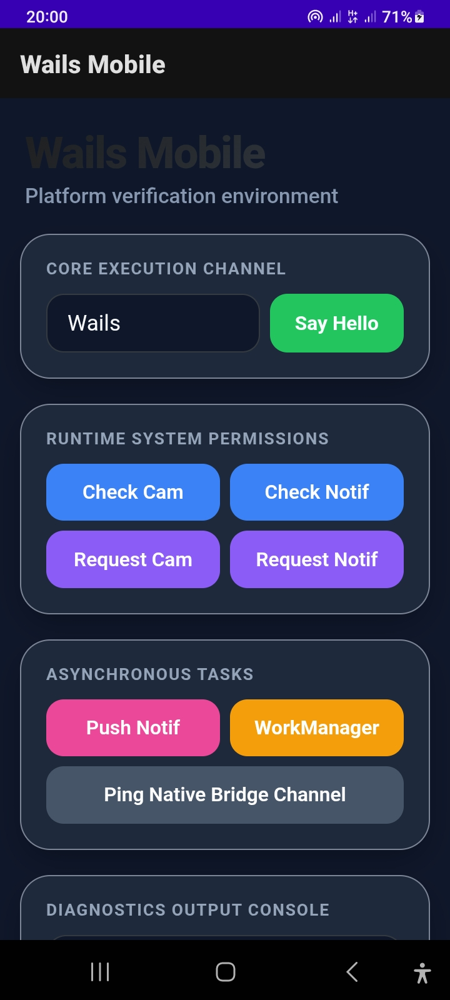
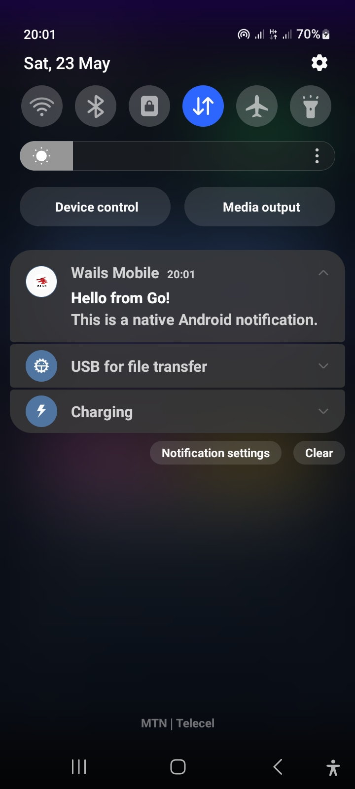
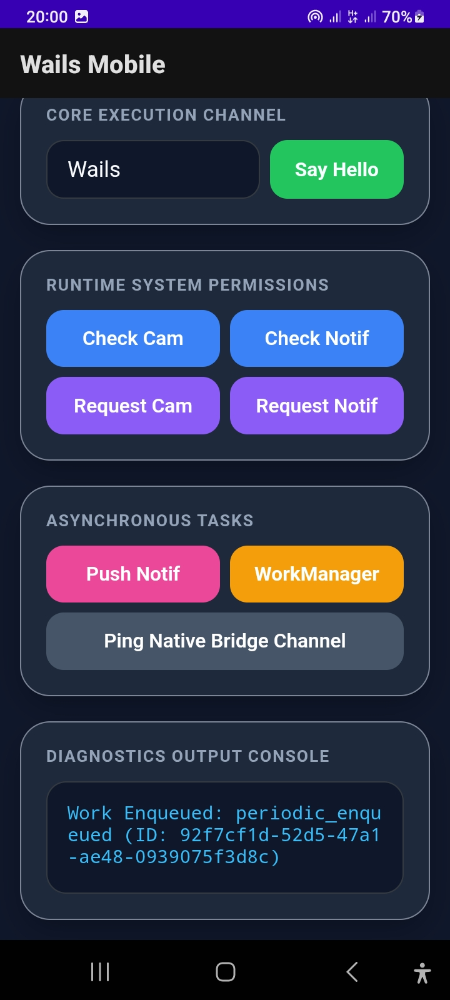

# Sweet Juice

Sweet Juice is an early port of Go v3 implementation to support mobile devies.

⚠️ **Important Note:** iOS support is currently in beta!

	
	
	

	
	
	
	

## Quick links

1. [Install & Build](docs/INSTALL.md)
2. [CLI reference](docs/CLI.md)
3. [Contributing](docs/CONTRIBUTING.md)
4. [Plugin docs](docs/PLUGINS_DOCS.md)
5. [Android plugin guide](docs/PLUGINS_ANDROID.md)
6. [iOS plugin guide](#)
7. [Example Sweet Juice app](github.com/sweet-juice/examples)
8. [Benchmarks](docs/BENCHMARKS.md)

## Requirements

- Go 1.24+
- Android SDK & NDK (install via Android Studio or your preferred method)
- `git`, `curl`, `unzip`

## Pre-packed plugins

| Plugin | Android | iOS |
| :--- | :---: | :---: |
| `plugins/logger` | `Yes` | `Yes` |
| `plugins/notification` | `Yes` | `Yes` |
| `plugins/permission` | `Yes` | `Yes` |
| `plugins/special-permission` | `Yes` | `No` |
| `plugins/devicestate` | `Yes` | `Yes` |
| `plugins/workmanager` | `Yes` | `Yes` |
| `plugins/osapi` | `Yes` | `Yes` |
| `plugins/biometrics` | `Yes` | `Yes` |
| `plugins/filepicker` | `Yes` | `Yes` |

See [Full List](#)

## Notes

- For contribution guidelines and plugin conventions see `docs/CONTRIBUTING.md`.
